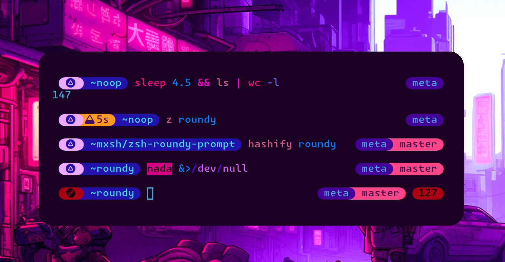

<div align=center>
  <h1>
    ᖇ𐑴ꭎ𐐻𖩎ʎ
    
  </h1>
  fast, cute, and of course, <em>roundy</em> prompt theme for zsh
</div>



# Features

- Fast and minimal
- Git branch integration
- Command execution time
- Exit status indicator
- Terminal title support
- Plugin manager support
- Configurable colors and icons
- Path shortening modes

# Install

```sh
# zinit
zinit light metaory/zsh-roundy-prompt

# antigen
antigen bundle metaory/zsh-roundy-prompt

# zplug
zplug metaory/zsh-roundy-prompt

# vanilla
git clone https://github.com/metaory/zsh-roundy-prompt ~/.zsh/roundy
echo 'source ~/.zsh/roundy/roundy.zsh' >> ~/.zshrc
```

# Required

- Unicode support: `echo -e '\ue0b6\ue0b4'` should show rounded separators
- Zsh 5.0 or newer

# Config

Theme colors and options can be configured in two ways:

1. Before sourcing (for plugin managers):
```zsh
# Set theme colors before loading
typeset -gA RT=(
  bg_ok 4    fg_ok 6    icon_ok •
  bg_err 1   fg_err 0   icon_err ×
  bg_dir 7   fg_dir 13  icon_time ⟳
  bg_usr 4   fg_usr 13
  bg_git 13  fg_git 7
  bg_time 3  fg_time 7
)

# Then load the theme
zinit light metaory/zsh-roundy-prompt
```

2. After sourcing (for manual installation):
```zsh
# First source the theme
source ~/.zsh/roundy/roundy.zsh

# Then override colors and options
typeset -gA RT=(...)
R_MODE=full
R_CODE=1
```

Both approaches work, but plugin managers might handle the timing differently.
Test which works better for your setup.

# Theme Colors

```zsh
# Theme colors (0-15 basic, 0-255 extended, black/red/..., #ff0000)
typeset -gA RT=(
  bg_ok 4    fg_ok 6    icon_ok •
  bg_err 1   fg_err 0   icon_err ×
  bg_dir 7   fg_dir 13  icon_time ⟳
  bg_usr 4   fg_usr 13
  bg_git 13  fg_git 7
  bg_time 3  fg_time 7
)

# Hex colors example (hexocd theme)
typeset -gA RT=(
  bg_ok   '#2211AA'  fg_ok   '#11BB99'  icon_ok   •
  bg_err  '#BB1122'  fg_err  '#110011'  icon_err  ×
  bg_dir  '#440099'  fg_dir  '#FFCCFF'  icon_time ⟳
  bg_usr  '#7766DD'  fg_usr  '#44DDEE'
  bg_git  '#CC44BB'  fg_git  '#110022'
  bg_time '#FF9922'  fg_time '#220022'
)

# Options

```zsh
# Default options and their effects
: ${R_MODE:=dir-only}  # Path display mode:
                       #   full     - show full path (/home/user/projects)
                       #   short    - show shortened path (/h/u/p)
                       #   dir-only - show only current directory (projects)

: ${R_CODE:=0}         # Show exit code in right prompt:
                       #   0 - hide exit code
                       #   1 - show non-zero exit codes

: ${R_MIN:=4}          # Minimum seconds to show execution time:
                       #   0 - disable time display
                       #   n - show time for commands longer than n seconds

: ${R_USR:=%n}         # Username format in prompt:
                       #   %n - username
                       #   %m - hostname
                       #   %n@%m - username@hostname
```

You can override these in your `.zshrc` after sourcing the theme:

```zsh
source ~/.zsh/roundy/roundy.zsh
R_MODE=full          # show full path
R_CODE=1             # show exit codes
R_MIN=2              # show time after 2s
R_USR='%n@%m'        # show user@host
```

# Path Modes

The prompt supports three path display modes:

```zsh
R_MODE=full     # /home/user/projects/roundy
R_MODE=short    # /h/u/p/roundy
R_MODE=dir-only # roundy
```

# Format

Prompt supports [zsh prompt expansion](https://zsh.sourceforge.io/Doc/Release/Prompt-Expansion.html):

```zsh
# Examples
R_USR="%n"         # username
R_USR="%m"         # hostname
R_USR="%n@%m"      # username@hostname
R_USR="%B%n%b"     # bold username
R_USR="%F{1}%n%f"  # red username
```

# Time Format

The time segment shows command execution duration when it exceeds `R_MIN` seconds:

```zsh
# Examples with R_MIN=4
1d 2h 3m 4s        # 93784s
2h 3m 4s           # 7384s
3m 4s              # 184s
4s                 # 4s
```

The time segment is hidden for:
- Commands that run less than `R_MIN` seconds
- When `R_MIN` is set to 0

# Terminal Title

The prompt automatically sets terminal title to:
- Current command while executing
- Current directory when idle

# Acknowledgment

Inspired by [Pure](https://github.com/sindresorhus/pure), [Spaceship](https://github.com/spaceship-prompt/spaceship-prompt), and [Powerline](https://github.com/powerline/powerline).

# License

[MIT](LICENSE)
