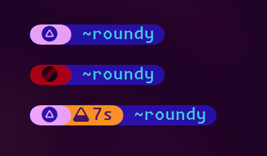

<div align=center>
    <br>
    fast, cute, and-of-course, <i>roundy</i> prompt theme for zsh
</div>

# Preview


> Using [hexocd-colorscheme](https://github.com/metaory/hexocd-colorscheme) and [Monaspace](https://monaspace.githubnext.com)

# Required

- [Nerd-patched](https://github.com/ryanoasis/nerd-fonts)'s Fonts
- Terminal with unicode support.

To check whether your terminal ready to using this theme, use this command :

```sh
echo -e '\ue0b6\ue0b4'
```

If it returns a circle, then we can go to the next step 🥳

# Installation

- zinit

```zsh
zinit light metaory/zsh-roundy-prompt
```

- antigen

```zsh
antigen bundle metaory/zsh-roundy-prompt
```

- zplug

```zsh
zplug metaory/zsh-roundy-prompt, use:roundy.zsh, from:github, as:theme
```

# Options

Options in roundy are configured in a regular variable, you can override it on your `.zshrc`.
Here's Default Options that currently available to override:

```sh
# Icon definition for Command's Exit Status
# Note: If your custom symbol overlaps the background or didn't have enough width,
#       you can add space at the end of your defined symbol.
ROUNDY_EXITSTATUS_OK="●"
ROUNDY_EXITSTATUS_NO="✖"

# Icon definition for Time Execution
ROUNDY_TEXC_ICON="▲"

# Minimal time (in seconds) for the Time Execution of Command is displayed in prompt
# Set to 0 to disable it
ROUNDY_TEXC_MIN_S=4

# Overriding right prompt info

# Any of zsh prompt escapes are valid
# view possible values:
man -P 'less -p "^SIMPLE PROMPT ESCAPES"' zshmisc

# %n username
ROUNDY_USR_CONTENT_NORMAL=" %n "

# %B for starting boldface
# %b for ending boldface
# %i for current history event number
ROUNDY_USR_CONTENT_NORMAL='%B%i%b'

# For when in sudo session
ROUNDY_USR_CONTENT_ROOT=" %n "


# Working Directory Info Mode
# Valid choice are : "full", "short", or "dir-only"
# Example Output
#   full     : /usr/share/awesome
#   short    : /u/s/a
#   dir-only : awesome
ROUNDY_DIR_MODE="full"

# Whether drawing a gap between a prompt
ROUNDY_PROMPT_HAS_GAP=true
```

## Colors

By nature of Zsh, colors can be specified using :

- a decimal integer (0-15, or 0-255 if `$TERM` supported)
- alias of the eight colors provided by zsh
- or, as a regular #FFFFFF color hex (if `$TERM` supported, or with the help of `zsh/nearcolor` module)

```sh
# Command Exit Status
ROUNDY_COLORS_BG_EXITSTATUS_OK=4
ROUNDY_COLORS_FG_EXITSTATUS_OK=0

ROUNDY_COLORS_BG_EXITSTATUS_NO=1
ROUNDY_COLORS_FG_EXITSTATUS_NO=0

# You can also use color name

# Time Execution of Command
ROUNDY_COLORS_BG_TEXC=yellow
ROUNDY_COLORS_FG_TEXC=0

# Right Prompt Display
ROUNDY_COLORS_BG_USR=5
ROUNDY_COLORS_FG_USR=255

# Directory Info
ROUNDY_COLORS_BG_DIR=4
ROUNDY_COLORS_FG_DIR=255

# You can also use hex code

# Git Info
ROUNDY_COLORS_BG_GITINFO='#4422BB'
ROUNDY_COLORS_FG_GITINFO=black
```

# Acknowledgement

- Forked from [nullxception/roundy](https://github.com/nullxception/roundy)
- Inspired by [Harry Elric](https://github.com/owl4ce)'s [Joyful Desktop v3](https://github.com/owl4ce/dotfiles/tree/3.0) prompt
- [ryanoasis](https://github.com/ryanoasis)'s [Nerd Fonts](https://github.com/ryanoasis/nerd-fonts) for half-circle and most of the awesome additional glyphs on Nerd Fonts

# License

Copyright © 2023- [metaory](https://github.com/metaory)
